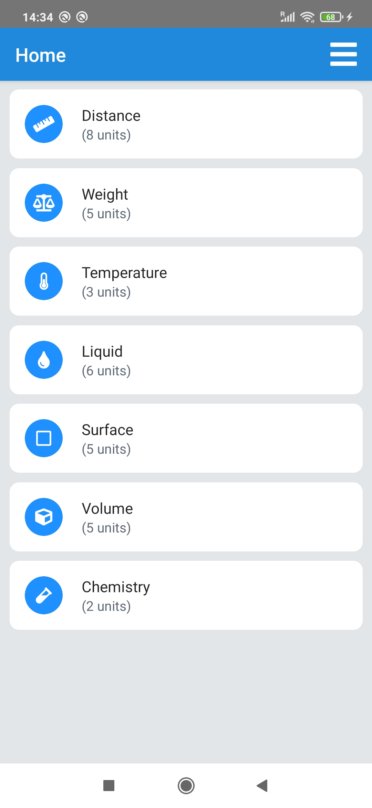
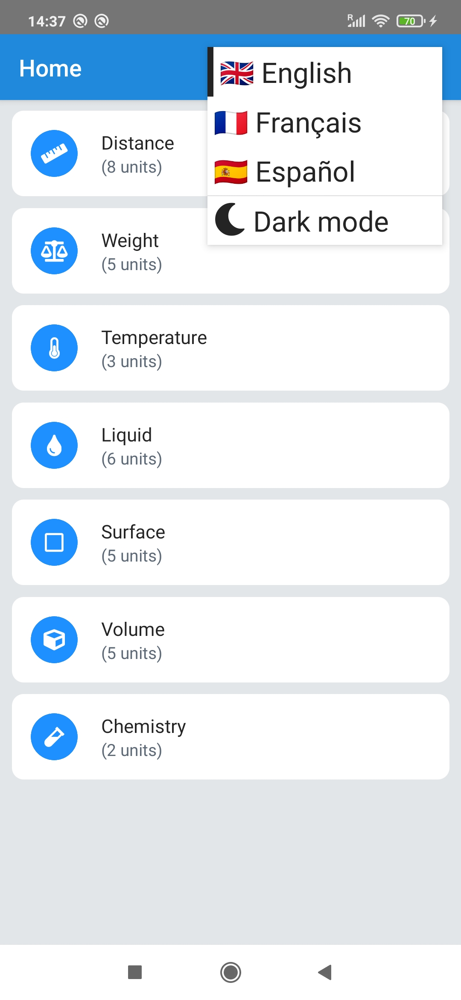
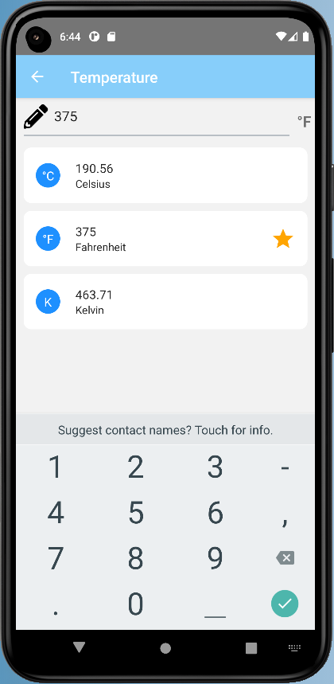

# UnitsTool
[](https://opensource.org/licenses/gpl-3.0)  
An application to convert units

Available languages : 🇬🇧, 🇫🇷, 🇪🇸

<div style="display: flex; flex-direction: row; justify-content: space-between;">
    
    
    
</div>

## Privacy
This application does not store or use any data from the user 

## How to use

* Select the category you want by touching it
* Select your favorite unit with a `long press`
* Enter your value to convert

> If the `conversion.json` file is updated, no need to update the application,  
> You just have to Pull down the list in the `Home` screen 👇

## Contribute

### Helping for a beautiful app icon
if someone can make a beautiful icon for this app, it will be very appreciate !

### By completing `conversion.json`
This file is the core of the application, it describe what is supposed to be displayed on the `Home` page, on each element in the list and the conversion formula to use.

> The `icon` key must have a value accepted on the [font-awesome](https://fontawesome.com/) website
#### Example of a category
```json
{
    "category": "mycategory",
    "title": "My Category",
    "icon": "tint",
    "reference": "UnityName",
    "units": [
        {
            "name": "UnityName",
            "symbol": "°C",
            "formula": "* 1"
        },
        {
            "name": "OtherUnity",
            "symbol": "°F",
            "formula": "* 1.8 + 32",
            "reverseFormula": "- 32 / 1.8"
        }
    ]
}
```
> The formula must always have a space between the `operand` and the `number` and there is no notion of mathematical priority. **It's always calculated in the order of the formula**.  
Also, for each `operand` you must have a following number and the first caracter must always be an operator (`+`, `-`, `*`, `/`).

## How to run

[React-native environment setup](https://reactnative.dev/docs/environment-setup)
```bash
# Run Metro in a terminal
npx react-native start
# Run the app
npx react-native run-android
```

## Resources

## docs
https://reactnative.dev/docs/getting-started  
https://reactnativeelements.com/    
https://reactnavigation.org/
